A native PC port of _GoldenEye 007_ (Rare, 1997, Nintendo 64), compiled from
the [GoldenEye 007 decompilation](https://github.com/n64decomp/007): the
original N64 game running from reconstructed source, not the Xbox 360
remaster. The N64's graphics coprocessor (RSP) is emulated in software; every
other hardware surface (video, audio, input, timers, save storage) is shimmed
in a dedicated `port/` layer, following the architecture of the
[Perfect Dark PC port](https://github.com/fgsfdsfgs/perfect_dark), the same
Rare "Indy" engine family, one hardware generation apart.

[Download](#download) · [News](#news) · [See it running](#see-it-running) · [Honest status](#honest-status) · [Documentation](#documentation)

**Status: v0.4.0 (2026-09-28) — fully playable, with a small set of known
caveats.** The full single-player campaign runs at a steady 60 fps and is
completable end to end (all 20 missions, plus the ending-credits sequence,
playtested on Windows, Linux and Steam Deck). It is the most complete release
to date: **native widescreen** (on by default — undistorted world at your
display's aspect, 4:3 menus pillarboxed), a **complete aim system** (N64 or
centred PC style, for mouse *and* controller), **in-game key rebinding** with
a GEPD-style default layout, **crosshair customization**, **rumble-pak
haptics** on supported gamepads, and a **rebuilt options overlay** with
fine-tuning rows (frame cap, MSAA, draw/LOD distance, HUD scale). The most
common defect classes from earlier releases — particle colour drift, water
seams, z-fighting, billboard trees, muzzle flashes, the front-end Nintendo
logo, gunshot SFX — are fixed in this version; what remains is a short list,
under [Honest status](#honest-status).

**This is a pre-1.0 release, not a finished product** — v1.0 is the target
for a polished, feature-complete build; expect missing features and the
occasional breaking change until then. See the
[README's Roadmap section](https://github.com/jkdansereau/goldeneye-pc-port#roadmap)
for direction (PAL/JP support, controller-button rebinding, LAN multiplayer
under consideration, and more).

  
   <em>~24 s gameplay montage from live v0.4.0 play sessions (Runway tank,
  Dam, Caverns, Aztec, Bunker&nbsp;2, Surface&nbsp;2), running in the port.</em>

## News

- **2026-09-28** — **v0.4.0**: native widescreen, a complete aim system for
  mouse and controller, in-game key rebinding, crosshair customization,
  rumble-pak haptics, a rebuilt options overlay, and a broad fidelity-fix
  pass (water, particles, billboard trees, front-end logo, gunshot SFX, a
  true stable 60 fps). [Release notes](https://github.com/jkdansereau/goldeneye-pc-port/releases/tag/v0.4.0) ·
  [downloads](#download).
- **2026-09-20** — **v0.3.0**: the first release with the complete campaign
  playable end to end at 60 fps on Windows, Linux, and Steam Deck.
  [Release notes](https://github.com/jkdansereau/goldeneye-pc-port/releases/tag/v0.3.0).
- **2026-09-04 → 2026-09-16** — **v0.1.0 – v0.2.2**: the alpha and beta
  cycle — build chain, software RSP, first rendered frames, front end, and
  per-level stabilization across the campaign.

## Download

| Platform | Bundle | Notes |
|---|---|---|
| **Windows** (x86_64) | [win64.zip](https://github.com/jkdansereau/goldeneye-pc-port/releases) | Engine + runtime DLLs + the one-time asset tool. |
| **Linux** (x86_64) / **Steam Deck** | [linux tarball](https://github.com/jkdansereau/goldeneye-pc-port/releases) | SDL2 is bundled, so it runs as-is on any distro, and sideloads onto a Deck with nothing installed. |

**Bring your own ROM.** Both bundles contain no ROM and no game assets: you
supply your own GoldenEye 007 N64 ROM (the
[Requirements table](https://github.com/jkdansereau/goldeneye-pc-port#requirements)
has the region filenames and SHA-1s). This release supports the NTSC-U (US)
ROM; PAL and JP are on the roadmap. Then: unpack, drop the ROM in `data/`,
and launch; the first run generates the derived assets automatically (no
Python or other tooling needed). The full steps are in the
[Quick start](https://github.com/jkdansereau/goldeneye-pc-port#quick-start);
pre-built releases are legal to distribute precisely because they're useless
without a ROM you already own.

## See it running

  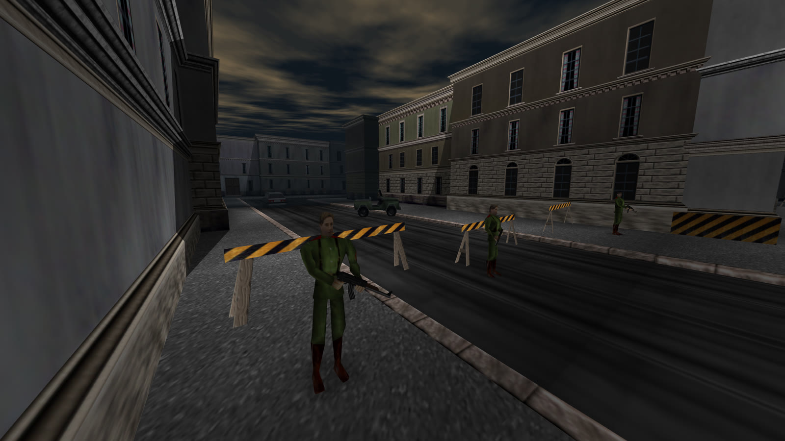
  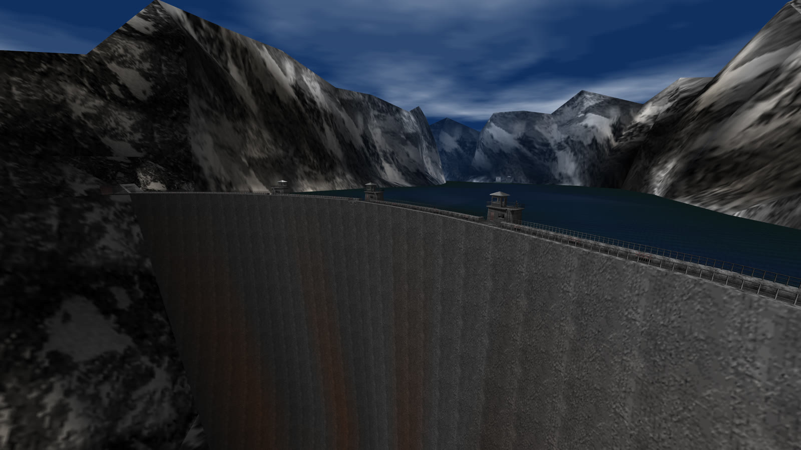

<strong>Full gallery</strong>: 12 in-engine captures from a v0.4.0 intro-attract pass (3072×1728 widescreen, Sep 2026)

  

    
    
<small>Dam</small>

  

  

    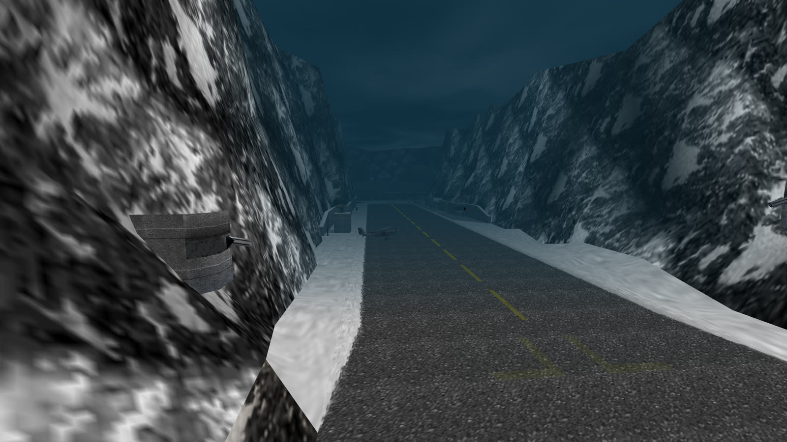
    
<small>Runway</small>

  

  

    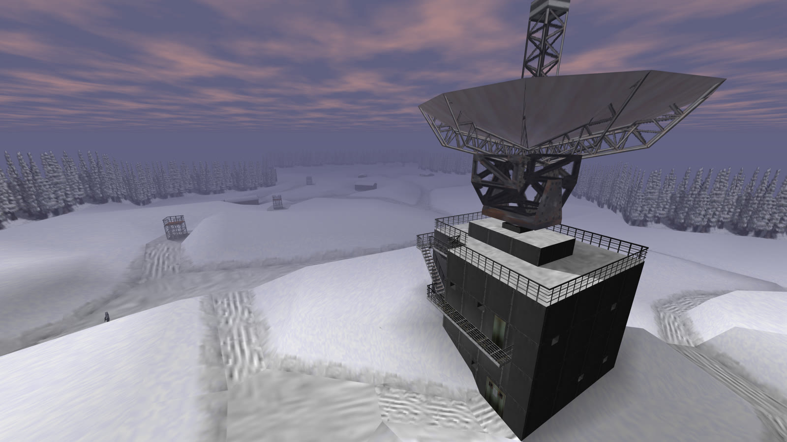
    
<small>Surface</small>

  

  

    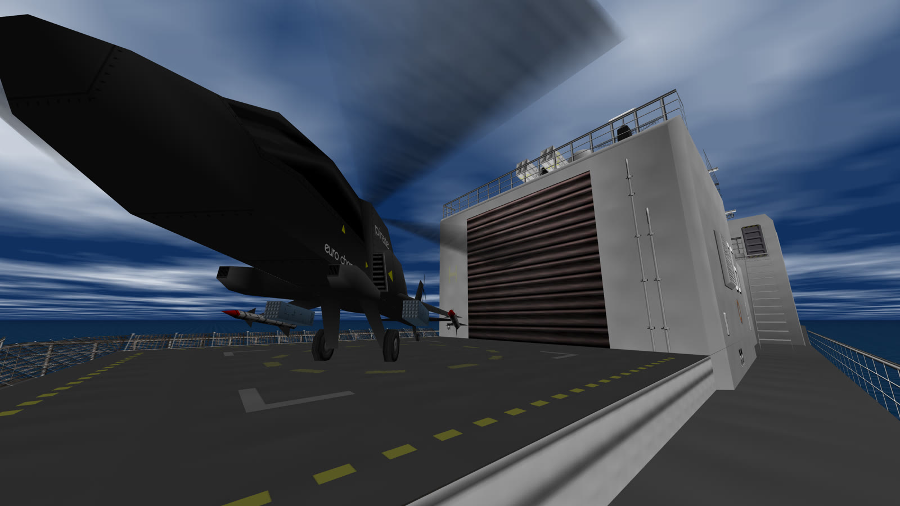
    
<small>Frigate</small>

  

  

    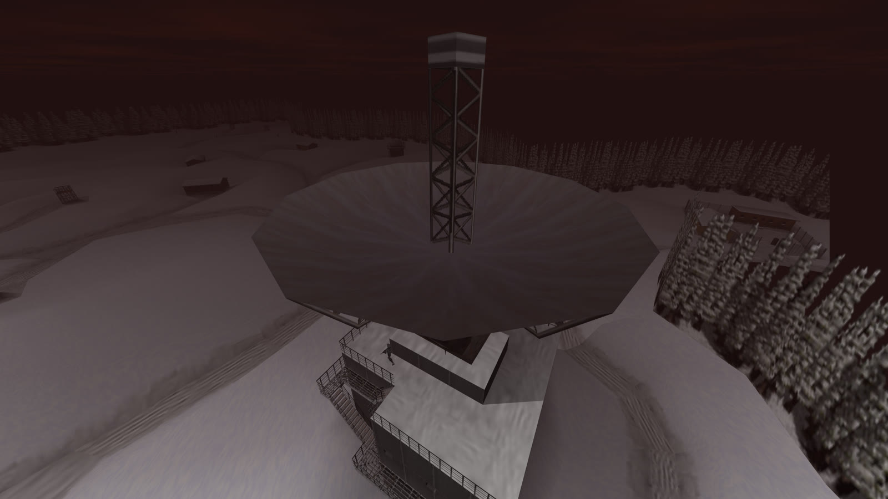
    
<small>Surface 2</small>

  

  

    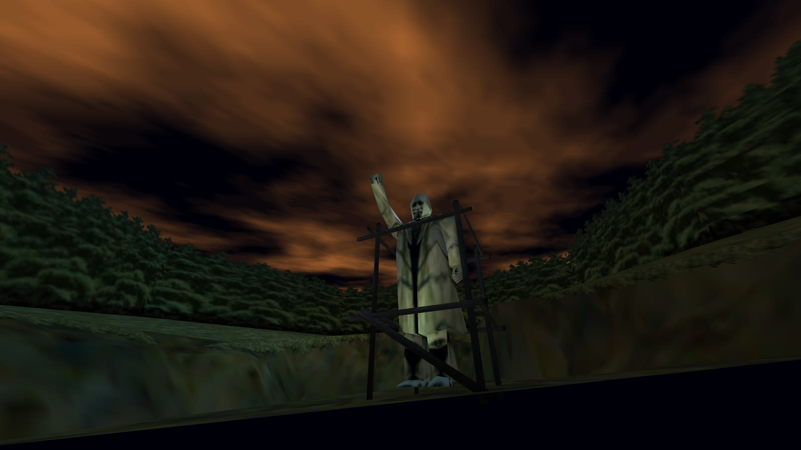
    
<small>Statue</small>

  

  

    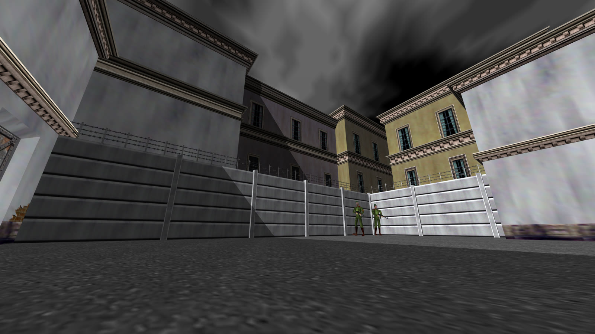
    
<small>Archives</small>

  

  

    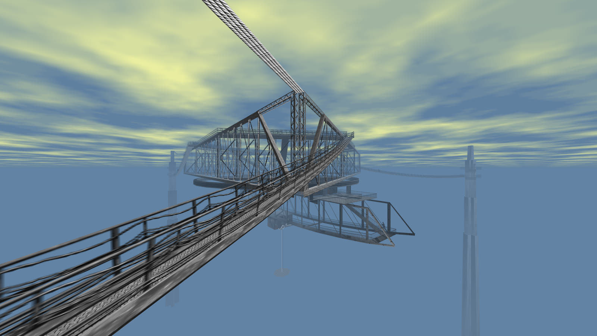
    
<small>Cradle</small>

  

  

    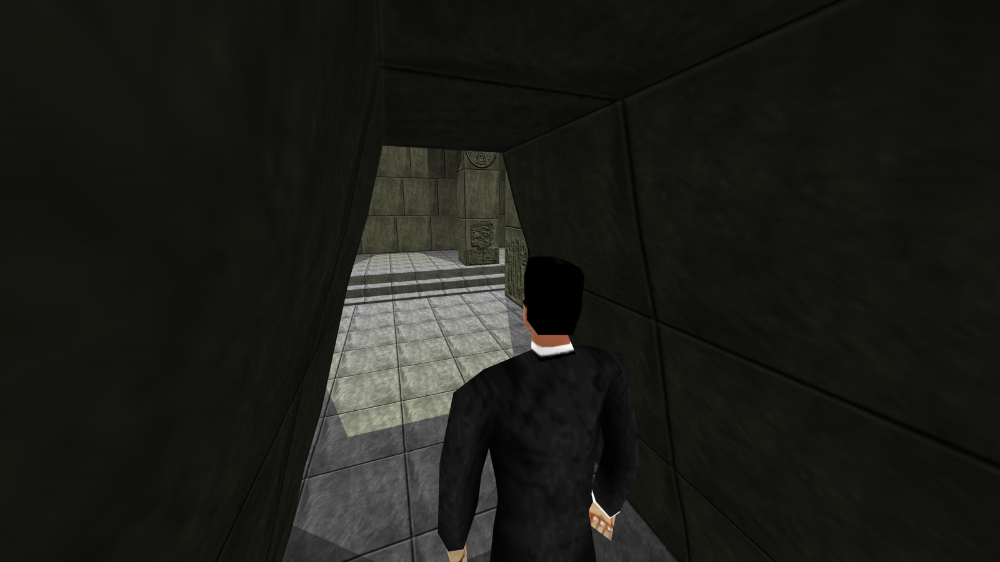
    
<small>Aztec</small>

  

  

    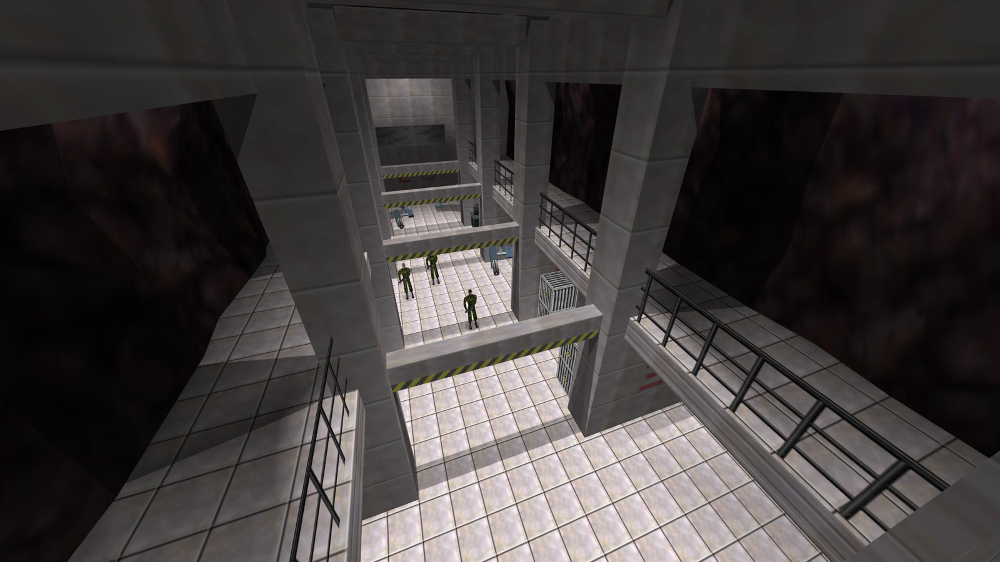
    
<small>Control</small>

  

  

    
    
<small>Streets</small>

  

  

    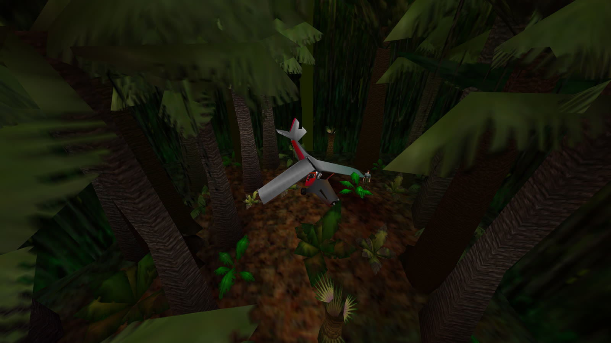
    
<small>Jungle</small>

  

More captures may land here as playtesting continues.

## Play it, or take it apart

- **Try it yourself**: grab a bundle above, bring your own ROM, and play the
  campaign. It's an early cut for exactly this: if something breaks, an
  [issue](https://github.com/jkdansereau/goldeneye-pc-port/issues) with what
  you were doing is genuinely useful.
- **Read the code**: the game logic in `src/` is unmodified decompilation;
  every hardware surface (video, audio, input, save storage, and the
  software-RSP renderer) is shimmed in the MIT-licensed `port/` layer.
  [Internals](internals.md) is the map; [Porting notes](porting-notes.md) is
  the catalogue of N64→PC bug classes hit along the way, a good read even if
  you never touch the code.
- **Mod it**: the port layer, build system and `tools_pc/` helpers are MIT
  licensed and yours to extend: new video options, input tweaks, your own
  asset sidecar. [CONTRIBUTING](https://github.com/jkdansereau/goldeneye-pc-port/blob/main/CONTRIBUTING.md)
  has the ground rules that keep it faithful to the original game.
- **AI disclosure**: development here was agentic — Claude Pro plus a local
  open-weight model on a single RTX 5090, as of August–September 2026. This
  project is as much a study of *that process* as it is a port: whether
  current LLMs can carry a codebase like this, and what actually goes wrong
  along the way. Game codebases have historically been a rough fit for
  LLMs — large, stateful, hardware-adjacent, unforgiving of a subtly wrong
  memory layout — more so for older local models, so this is a useful data
  point on where that stands now, for better or worse. Judge the result for
  yourself. I'm one person doing this in my spare time, not a team. See
  [the full write-up](dev/agentic-development.md) for the setup, timeline,
  handoff workflow, and an honest assessment of what did and didn't work.

## How it works

The R4300 game code is compiled completely unmodified; the decompilation's
control flow is ground truth. The N64's Reality Signal Processor, the graphics
coprocessor that builds and executes each frame's display list, is emulated in
software: the port interprets the GBI stream the game emits and translates it
to OpenGL, bypassing the RDP entirely. Everything else that would touch N64
hardware (video, audio, input, timers, save storage) is shimmed in a small
dedicated layer, following the architecture of the Perfect Dark PC port from
the same Rare engine family. Full detail: [Internals](internals.md); the bug
catalogue: [Porting notes](porting-notes.md).

## Honest status

- On Facility, if gas leaks during Ourumov's monologue he can pause for up to
  ~10 s before resuming the scripted shootout — a latent race that exists in
  the N64 original too (where it softlocks permanently); the port detects and
  auto-recovers it. (D318)
- With native widescreen on, the F10 options overlay stretches with the
  window instead of pillarboxing like the front-end menus (legible; cosmetic;
  the F10 *Native widescreen* toggle restores the old stretched frame
  throughout). The world/HUD widescreen rendering itself is correct. (D335b)
- The front-end Rareware logo shows a subtle texture-filtering artifact
  (the Nintendo logo and legal page are clean). Cosmetic only. (D75)
- **`All unlocked` is experimental**: the fresh-install corruption case is
  fixed, but saves made while it is on are not guaranteed recoverable by
  switching it off — complete a level normally first, and back up
  `data/ge007.eep` before enabling it. (D387)
- No macOS or ARM support. Keyboard/mouse rebinding shipped in v0.4.0;
  controller-button rebinding is not supported yet.

The full list, with root causes and fix status: the
[release notes](https://github.com/jkdansereau/goldeneye-pc-port/releases)
and the [finding log](https://github.com/jkdansereau/goldeneye-pc-port/tree/main/docs/dev).

## Documentation

- [The two-agent development case study](dev/agentic-development.md): goal, setup, timeline, the handoff workflow, and an honest assessment of what did and didn't work.
- [Development process](dev-process.md): how work was scoped, partitioned, and budgeted across agents; the finding-log discipline.
- [Internals](internals.md): architecture, the software RSP-emulation approach, GoldenEye-vs-Perfect-Dark engine differences, the phased plan.
- [Porting notes](porting-notes.md): the recurring Nintendo 64 → PC bug classes hit during the port, with fixes.
- [Building](building.md): full build and asset-extraction guide.
